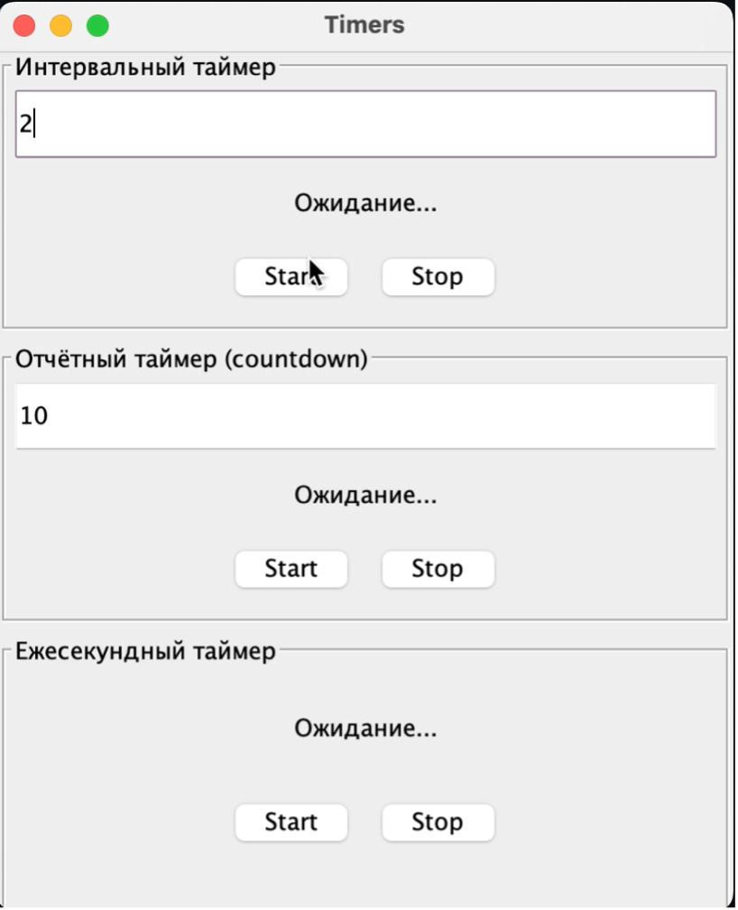

# Java Timers — OS Lab 1

Интерактивное графическое приложение на **Java**, демонстрирующее работу трёх видов таймеров:  
- **Интервальный (Periodic)** — повторяющиеся события через заданный интервал  
- **Отчётный (Countdown)** — отсчёт времени до завершения  
- **Ежесекундный (Heartbeat)** — срабатывает каждую секунду  

Приложение создано в рамках курса **«Операционные системы»** для изучения работы с системным временем и планирования задач.

---

## Технологии

- Java SE 17+  
- Swing (javax.swing.Timer)   

---

## Демо-видео

---

## Особенности проекта

- Каждый таймер реализован в отдельном классе (инкапсуляция, наследование)  
- Приложение позволяет наблюдать за срабатыванием таймеров в реальном времени  
- Возможность изменения параметров таймеров вручную делает работу интерактивной  
- Использование Swing обеспечивает безопасное обновление GUI при срабатывании таймеров  

---

## Автор

Разработано как учебный проект по дисциплине **«Операционные системы»**.  
**Никита Козловский**  
[GitHub профайл](https://github.com/CozlovschiNichita)  
